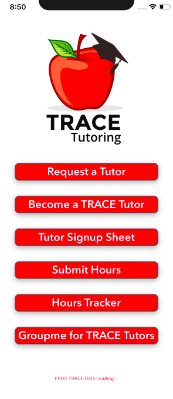
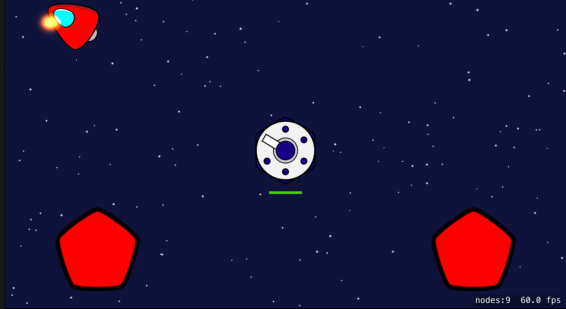

# About Me!
2020-20121 Portfolio

Hey there, I'm Vincent Nguyen. This portfolio showcases my projects I've been working on in my 2020 iOS Mobile App Development class at Eden Prairie Highschool. I've learned about using Spreadsheet APKs, basic user interface with SwiftUI, and making a simple game using SpriteKit. I was able to learn a little bit of the basics of Swift through YouTube, Apple Tutorials, and looking at game examples. Simultaneously, I'm taking a 2020 Intro to Java Programming class at the University of Minnesota to help build my foundation in programming.

# Projects
**TRACE App**  

I learned how to import data from a google spreadsheet using APKS, create buttons that link to an in-app spreadsheet, and basic user interface.
I originally wanted to use this app to organize my tutoring club links for my tutors, but we found that a linktr.ee would suffice. Nonetheless, this was a good first project into Swift.

**APBO App**

This is a work in progress app that is a space shooting game that I plan to convert into an online multiplayer game. It has taught me the basics of SpriteKit as well as helping me realize the importance of mathematics in the physics of sprites.

# Programming Experience

Java (2020-)  
Swift (2020-)  
