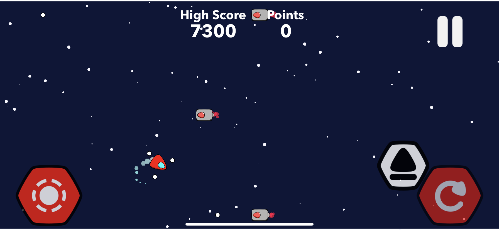
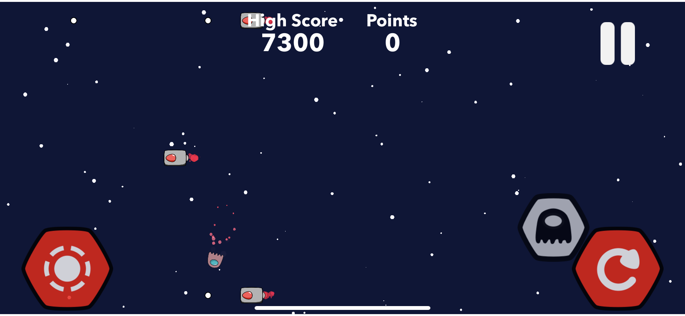
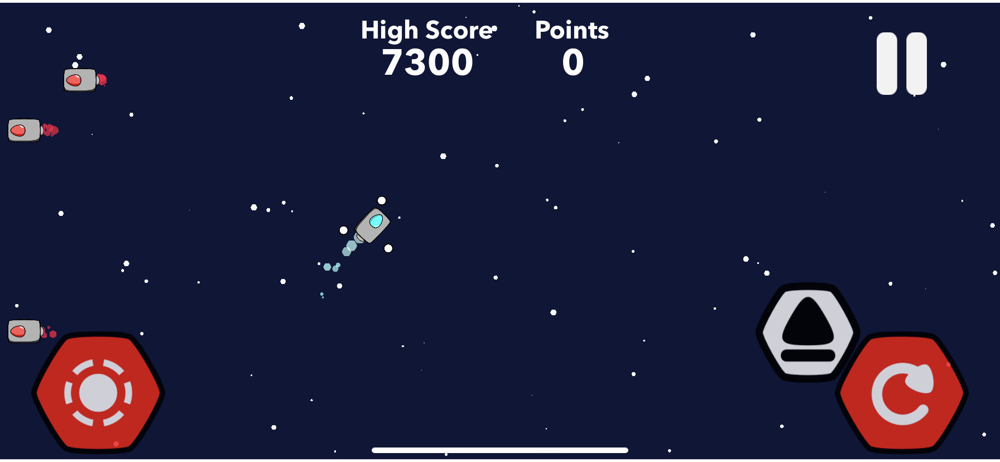
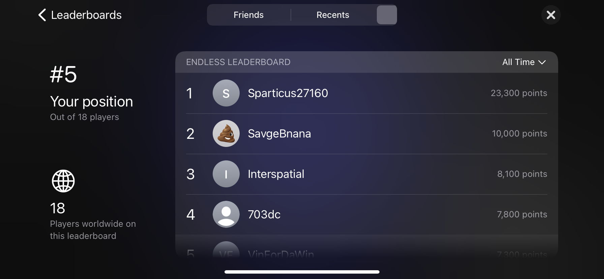
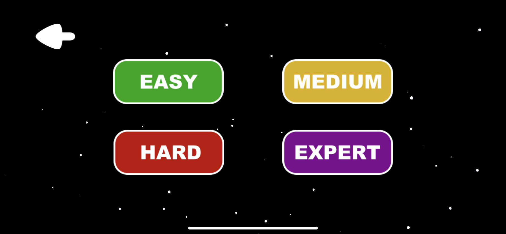
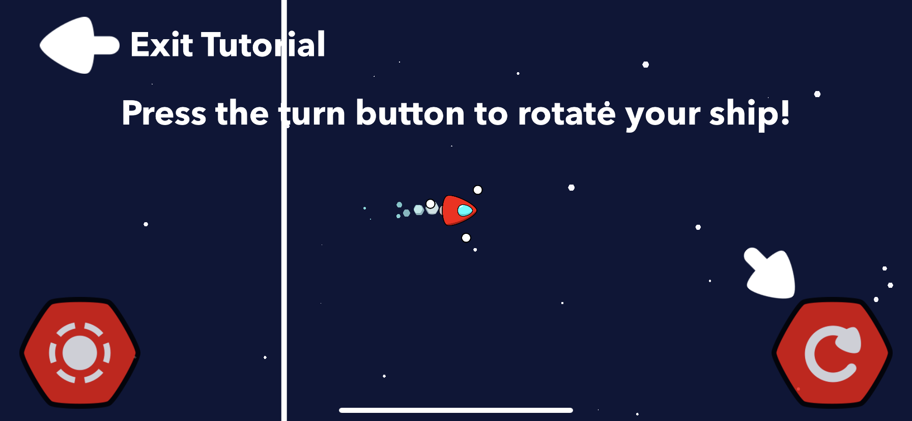

# About Me!
2020-20121 Portfolio

Hey there, I'm Vincent Nguyen. This portfolio showcases my projects I've been working on in my 2020 iOS Mobile App Development class at Eden Prairie High School. I've learned about using Spreadsheet APKs, basic user interface with SwiftUI, and making a simple game using SpriteKit. I was able to learn a little bit of the basics of Swift through YouTube, Apple Tutorials, and looking at game examples. I am taking Advanced iOS Mobile App Development to further bring my Ghost Pilots to greatness!

# Projects

[**TRACE App**](https://github.com/Nagooy3n/TraceApp)

I learned how to import data from a google spreadsheet using APKS, create buttons that link to an in-app spreadsheet, and basic user interface.
I originally wanted to use this app to organize my tutoring club links for my tutors, but we found that a linktr.ee would suffice. Nonetheless, this was a good first project into Swift.

[**Ghost Pilots App**](https://github.com/1201dc/APBOv2)

Version 1.0

Version 2.0

This is my latest project which is a space shooter app called Ghost Pilots (Download in the App Store!). I've learned how to incorporate mathematics and problem solving into my game through its many features such as a ghost take over of enemy ships, handling collisions, and keeping track of data. I plan to transition to an online multiplayer game where players can connnect with others around the globe to either fight each other or team up. You can check out the video that goes throught the features in these repository files. 

I learned how to create artwork for the character models and buttons , how to send a game to the App Store, as well as create enticing images for the app previews.

The latest features of version 2.0 are: 

• Phasing feature to take over enemies

• Global Game Center Leaderboard

• 4 difficulties for Turret Boss

• Tutorial

# Programming Experience

Java (2020-)  
Swift (2020-)  
